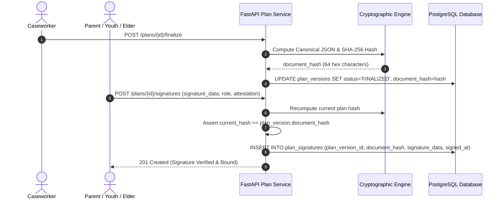

# ADR-014: Cryptographic Electronic Signatures & Physical Signature Ingestion

**Status:** Approved  
**Date:** 2026-08-31  
**Deciders:** CRBCL Architecture & Security Board  
**Technical Context:** CRBCL Family Wellness Case Management Platform — Phase 6  

---

## Context & Problem Statement

In child welfare practice, family plans must be signed by multiple parties:
1. Assigned Caseworkers & Supervisors (authenticated system users).
2. Parents, Guardians, and Kinship Caregivers (community members without staff logins).
3. Youth & Children (where age-appropriate).
4. Community Elders & Cultural Support Workers.
5. External Service Providers (e.g. Health, Mental Health, Education).

Furthermore, in remote reserve settings and home visits, signatures may be gathered through:
- In-person electronic drawing on tablets or mobile web browsers.
- Scanned physical paper documents signed with pen in community.

A critical security vulnerability in legacy systems is **signature detachment**: storing a signature PNG image in isolation without binding it to the exact text/content of the plan agreed upon. If a caseworker subsequently changes a goal or concern, the old signature silently appears valid for the modified agreement.

---

## Decision Drivers

1. **Document Integrity & Non-Repudiation:** Signatures must cryptographically bind to the exact snapshot of the plan version.
2. **Multi-Party Support:** Must accommodate authenticated staff as well as non-staff community members without requiring external accounts.
3. **Dual Execution Channels:** Equal support for Electronic In-App Signing and Scanned Physical Signature Uploads.
4. **Tamper Detection:** If any content in a finalized plan version is altered, existing signatures must be invalidated or prevent tampering via immutability.
5. **Auditing & Privacy:** Capture essential non-repudiation audit data (signer name, role, attestation, timestamp, IP) without over-collecting personal biometric data.

---

## Architectural Decision

### 1. Canonical Plan Serialization & Deterministic Hashing

When a plan version is **Finalized** (`POST /api/v1/plans/{id}/finalize`):
1. The backend builds a normalized, deterministic JSON representation of the plan version containing:
   - Version ID and version number
   - Meeting date and narrative
   - Ordered list of participants (`name`, `role`, `attendance_status`)
   - Ordered list of concerns (`concern_type`, `statement`, `severity`)
   - Ordered list of strengths (`category`, `statement`)
   - Ordered list of goals and nested activities (`goal_text`, `target_date`, `activity_text`, `responsible_name`, `due_date`)
2. The backend computes the **SHA-256 cryptographic hash** of the UTF-8 encoded canonical JSON.
3. The resulting 64-character hexadecimal digest is stored in `plan_versions.document_hash`.

### 2. Signature Validation Rules

When a signature is submitted (`POST /api/v1/plans/{id}/signatures`):
1. The plan version must be in `FINALIZED` or `LOCKED` state. Signatures are rejected on `DRAFT` or `IN_REVIEW` plans (`400 Bad Request`).
2. The current canonical hash is computed and verified against the stored `document_hash`. If any field differs, the signature is rejected.
3. The signature record stores:
   - `plan_version_id`: Foreign key to the exact version.
   - `document_hash`: The SHA-256 hash verified at signing time.
   - `signer_type`: (`WORKER`, `PARENT_GUARDIAN`, `CHILD_YOUTH`, `ELDER`, `PROVIDER`, `OTHER`).
   - `signer_user_id`: Linked if signed by an authenticated staff user.
   - `signer_person_id`: Linked if matched to a canonical Person record.
   - `signer_name` and `signer_role`: Exact snapshot strings.
   - `signature_data`: Vector/canvas coordinate data or base64 SVG/PNG.
   - `method`: `ELECTRONIC_DRAW`, `ELECTRONIC_TYPE`, or `PHYSICAL_UPLOAD`.
   - `attestation_text`: Standard legal statement (e.g. *"I agree with this Family Wellness Plan and my commitments within it."*).
   - `signed_at`: Server-authoritative UTC timestamp.

### 3. Physical Scanned Upload Workflow

For paper documents signed in the community:
1. Worker prints the finalized plan via `GET /api/v1/plans/{id}/print`. The print output displays the unique `Plan Number`, `Version Number`, and `Document Hash`.
2. Family and workers sign the physical paper.
3. Worker uploads the scanned PDF/image via `POST /api/v1/plans/{id}/physical-signature`.
4. The file is uploaded through the unified Document Storage infrastructure with category `SIGNED_PLAN`.
5. A `plan_signatures` record is created with method `PHYSICAL_UPLOAD`, linking to the stored document attachment.

---

## Consequences & Security Posture

- **Unbroken Chain of Custody:** No signature can ever be applied to modified plan text.
- **Audit Logging:** Every signature creation emits events to `audit_events` and `timeline_events` with non-sensitive metadata.
- **Director Governance:** Once all required signatures are obtained, the plan is locked (`LOCKED`). Unlocking is restricted to Directors and requires written justification.
