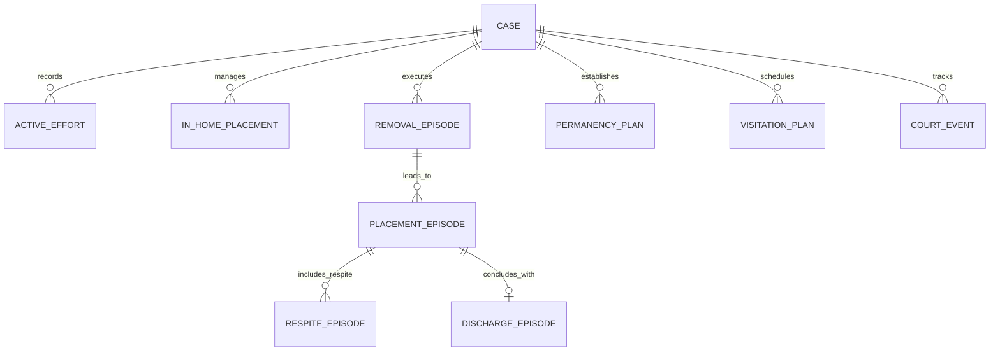

# ADR-015: Child Removal, Placement Episode Chain, Respite & Discharge Architecture

## Status
**ACCEPTED** (Phase 7 — Active Efforts, Removals, Placements, Permanency, Visitation & Court Operations)

## Context
Under First Nations child welfare standards (Treaty 4 / Cote First Nation) and provincial regulatory requirements, the transition of a child from parental care to family preservation (in-home), customary care, kinship, or out-of-home placement requires strict legal authority tracking, continuous active efforts documentation, and longitudinal episode auditing.

Previously, temporary placements were sometimes treated as unstructured free-text or JSON arrays on case records, creating severe risks of data loss, unrecorded concurrent placements, ambiguous discharge tracking, and inadequate legal auditability during court proceedings.

## Decision
We implement a fully normalized, relational child removal and placement episode chain consisting of distinct bounded entities:

1. **Active Efforts (`active_efforts`)**:
   - Represents statutory obligations to provide remedial and preventive services to preserve the Indigenous family prior to or during custody actions.
   - Captures service category, provider, outcome (`SUCCESSFUL`, `ONGOING`, `UNSUCCESSFUL`, `REFUSED`), barriers, remedial actions, and assigned worker.

2. **In-Home Placements (`in_home_placements`)**:
   - Represents structured in-home safety arrangements where the child remains in parental/caregiver custody under departmental supervision, safety monitoring, and wraparound support services.

3. **Removal Episodes (`removal_episodes`)**:
   - Represents the formal legal and physical act of taking a child into protective custody.
   - Captures legal authority type (`CHILD_WELFARE_WARRANT`, `CONSENT_AGREEMENT`, `POLICE_ASSISTANCE`, `COURT_ORDER`), removal type (`VOLUNTARY`, `EMERGENCY_ORDER`, `COURT_APPREHENSION`, `TEMPORARY_CUSTODY`), location, accompanying officers, child condition, and personal belongings inventory.

4. **Placement Episodes (`placement_episodes`)**:
   - Represents each distinct out-of-home care interval (e.g. Kinship, Customary Care, Foster Care, Group Home, Independent Living).
   - Links back to the triggering `removal_episode_id`.
   - Tracks provider identity, primary caregiver, per diem rates, cultural plan status, start/end dates, and status (`ACTIVE`, `DISRUPTED`, `PLANNED_DISCHARGE`, `TRANSFERRED`, `COMPLETED`).

5. **Respite Episodes (`respite_episodes`)**:
   - Models temporary relief care provided to primary caregivers or foster parents.
   - Sit **within** an active primary placement episode. Respite does **NOT** discharge, terminate, or disrupt the primary placement.

6. **Discharge Episodes (`discharge_episodes`)**:
   - Models the formal, legal conclusion of a placement episode.
   - Captures discharge type (`REUNIFICATION`, `CUSTOMARY_ADOPTION`, `PERMANENT_KINSHIP`, `AGING_OUT`, `TRANSFER`, `OTHER`), destination details, post-discharge supervision plans, readiness assessments, and supervisor approval.
   - Atomically updates the associated `placement_episodes` record to `COMPLETED` / `DISCHARGED`.

7. **Permanency Plans & Visitation Plans (`permanency_plans`, `visitation_plans`)**:
   - Permanency plans establish primary and concurrent goals (reunification, customary care, kinship legal custody), cultural connection strategies, sibling co-placement strategies, and review intervals.
   - Visitation plans define family contact schedules, supervision mandates, locations, and safety conditions.

8. **Court Events (`court_events`)**:
   - Tracks legal proceedings, hearings, docket numbers, judges, band representative appearances, outcomes, court orders, and adjourned/next appearance dates.

## Entity Relationship Diagram

## Consequences

### Positive
- Strict auditability of all child welfare movements and legal authorities.
- Full compliance with First Nations customary care principles and statutory active efforts mandates.
- Clean separation between active out-of-home placements, in-home diversion, temporary respite, and permanent discharge.
- Elimination of data duplication and JSON array mutation bugs.

### Considerations
- All endpoints must enforce ADR-010 Conflict-of-Interest Case Restrictions.
- Every state transition must emit structured `audit_events`, `timeline_events`, and transactional `outbox_events`.
