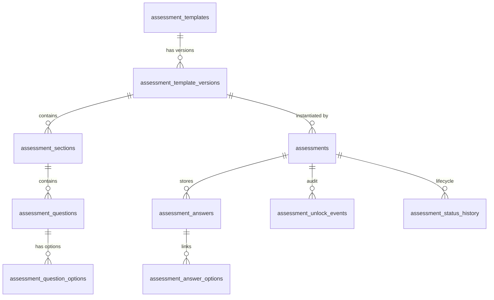

# CRBCL Configurable Assessment Engine Architecture

**Document Version:** 1.0  
**Phase:** 5 (Configurable Assessment Engine)  
**Status:** Approved & Implemented  

---

## 1. Executive Summary

The **CRBCL Assessment Engine** provides a reusable, dynamic, and versioned framework for administering child welfare and family wellness assessments across the Cowessess First Nation community.

Rather than creating bespoke database schemas and frontend pages for every new questionnaire, the Assessment Engine introduces a generalized, data-driven architecture that supports:
1. **Template & Section Hierarchy:** Configurable questions with robust data types (`BOOLEAN`, `NUMBER`, `TEXT`, `LONG_TEXT`, `DATE`, `DATETIME`, `SINGLE_SELECT`, `MULTI_SELECT`, `JSON`).
2. **Strict Versioning & Immutability:** Published template versions are strictly immutable. Assessments retain permanent binding to the specific template version under which they were conducted.
3. **Normalized Typed Columns & Relational Options:** Answers are stored in typed SQL columns (`boolean_value`, `number_value`, `text_value`, `date_value`, `datetime_value`, `json_value`) and a dedicated join table (`assessment_answer_options`), enabling direct SQL analytics, reporting, and aggregation without JSON parsing.
4. **Declarative Conditional Visibility:** Safe rule evaluation (`equals`, `not_equals`, `is_true`, `is_false`, `contains`) dynamically shows or hides follow-up questions and entire sections.
5. **Deterministic Indicator Aggregations:** Safety indicators (e.g. Present Danger, Impending Danger, Caregiver Strengths) are calculated deterministically without opaque AI algorithms, leaving clinical and legal determination to authorized workers and supervisors.
6. **Strict Director Governance:** Once finalized and locked, assessments cannot be modified. Unlocking requires Director-level privileges (`assessment.unlock`) with mandatory justification, recorded in append-only unlock event logs, audit trails, and case timelines.
7. **Time-Series Delta Comparison:** Workers can compare multiple assessment instances across time for the same individual or family, visualizing clinical progress and changes across indicators.

---

## 2. Relational Schema Architecture

### Table Definitions

| Table Name | Purpose | Key Attributes |
| :--- | :--- | :--- |
| `assessment_templates` | Logical template identity | `id`, `key`, `name`, `category`, `is_active` |
| `assessment_template_versions` | Immutable version snapshot | `id`, `template_id`, `version_number`, `status` (`DRAFT`/`PUBLISHED`/`ARCHIVED`), `effective_from`, `effective_to` |
| `assessment_sections` | Logical groupings within a version | `id`, `template_version_id`, `key`, `title`, `sort_order`, `is_required`, `visibility_condition` |
| `assessment_questions` | Individual assessment items | `id`, `section_id`, `key`, `label`, `question_type`, `is_required`, `sort_order`, `is_reportable`, `validation_rules`, `visibility_condition` |
| `assessment_question_options` | Available options for select questions | `id`, `question_id`, `key`, `label`, `score_value`, `sort_order` |
| `assessments` | Instance completed for a case/person | `id`, `case_id`, `person_id`, `template_id`, `template_version_id`, `assessment_number`, `status`, `determination`, `locked_at`, `locked_by` |
| `assessment_answers` | Normalized, typed responses | `id`, `assessment_id`, `question_id`, `boolean_value`, `number_value`, `text_value`, `date_value`, `datetime_value`, `json_value`, `notes` |
| `assessment_answer_options` | Normalized multi-select join table | `id`, `answer_id`, `option_id` |
| `assessment_unlock_events` | Append-only Director unlock audit | `id`, `assessment_id`, `unlocked_by`, `reason`, `unlocked_at` |
| `assessment_status_history` | Full status lifecycle state transitions | `id`, `assessment_id`, `from_status`, `to_status`, `reason`, `created_by`, `created_at` |
| `assessment_sequences` | Year-month atomic sequential numbering | `year_month`, `current_val` |

---

## 3. Seeded Standard Assessment Templates

### 1. Home Assessment (`HOME_ASSESSMENT` v1)
Evaluates physical living conditions, environmental hazards, sanitation, and caregiver protective capacities:
* **Section 1: Home Concerns & Substances (`HOME_CONCERNS`)** — Assesses substance concerns and hazardous chemicals with conditional follow-up detail fields.
* **Section 2: Physical Living Conditions (`PHYSICAL_STATUS`)** — Assesses structural safety, utilities (running water, winter heating), overcrowding, and maintenance.
* **Section 3: Caregiver Protective Capacities (`CAREGIVER_CAPACITIES`)** — Strength-based assessment of hazard recognition, willingness to remedy, and kin support.
* **Section 4: Home Safety Determination (`HOME_DETERMINATION`)** — Formal caseworker safety determination (`CHILD_SAFE_AT_HOME`, `SAFETY_PLAN_CREATED`, `CUSTODY_NEEDED`).

### 2. Threat & Safety Assessment (`THREAT_ASSESSMENT` v1)
Structured evaluation of immediate and impending danger to child welfare:
* **Section 1: Present Danger (`PRESENT_DANGER`)** — Immediate, acute peril, severe harm, or caregiver incapacitation requiring immediate protective intervention.
* **Section 2: Impending Danger (`IMPENDING_DANGER`)** — Out-of-control, escalating danger and child vulnerability factors.
* **Section 3: Alternative Safety Interventions (`ALTERNATIVE_INTERVENTIONS`)** — Kinship safety placement and community monitoring support.
* **Section 4: Final Threat Determination (`THREAT_DETERMINATION`)** — Formal safety decision (`SAFE`, `SAFE_WITH_SERVICES`, `UNSAFE`).

### 3. AIEI Assessment (`AIEI_ASSESSMENT` v1)
Early intervention and prevention screening for family wellness:
* **Section 1: Primary Referral Reason (`PRIMARY_REASON`)** — Housing, food security, respite care, or cultural connection.
* **Section 2: Family Strengths & Protective Factors (`FAMILY_STRENGTHS`)** — Cultural practices, family engagement, and community ties.
* **Section 3: Resource & Support Needs (`SUPPORT_NEEDS`)** — Identified prevention resources, daycare, emergency food, transportation.
* **Section 4: Prevention Plan Determination (`AIEI_DETERMINATION`)** — Actionable wellness recommendation (`COMMUNITY_LINKAGE_SUFFICIENT`, `PREVENTION_PLAN_REQUIRED`, `ESCALATE_TO_FORMAL_INTAKE`).

---

## 4. Deterministic Indicator Engine

To uphold indigenous sovereignty, transparency, and child welfare compliance, **no automated AI models or black-box algorithms determine child danger or safety**.

The engine computes deterministic summaries from normalized question keys:
* **Danger Threats Active:** Evaluates boolean flags such as `immediate_physical_harm`, `caregiver_incapacitated`, `child_in_acute_peril`.
* **Impending Danger Active:** Evaluates flags such as `uncontrolled_escalating_threat`, `vulnerable_child`.
* **Protective Capacities Count:** Tallies positive indicators such as `kinship_safety_resource`, `community_monitoring_active`, `recognizes_hazards`, `support_network_present`.
* **Legal Determination:** Selected by authorized practitioners upon clinical review.

---

## 5. Security & Governance

1. **Role-Based Access Control (RBAC):**
   * Workers require `assessment.create`, `assessment.read`, and `assessment.update` to draft assessments.
   * `assessment.complete` is required to finalize determinations.
   * `assessment.lock` seals completed assessments against tampering.
   * `assessment.unlock` is strictly restricted to Directors with mandatory written justification.
   * `assessment.reassign` allows Directors to reassign misfiled assessments between cases/families.
2. **Case Restrictions:**
   * If a user is restricted from a case (e.g. conflict of interest), all assessment read, write, compare, and unlock endpoints return `403 Forbidden`.
3. **Audit Trail & Timeline:**
   * Every creation, answer save, completion, lock, unlock, and reassignment emits events to `audit_events` and `timeline_events`.
