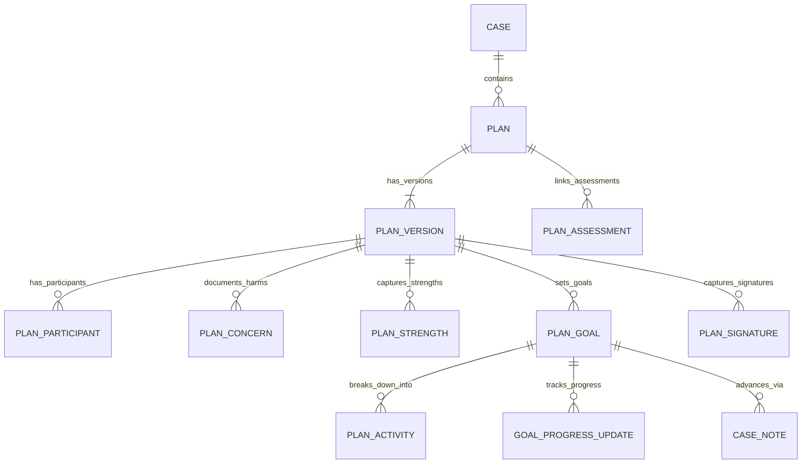
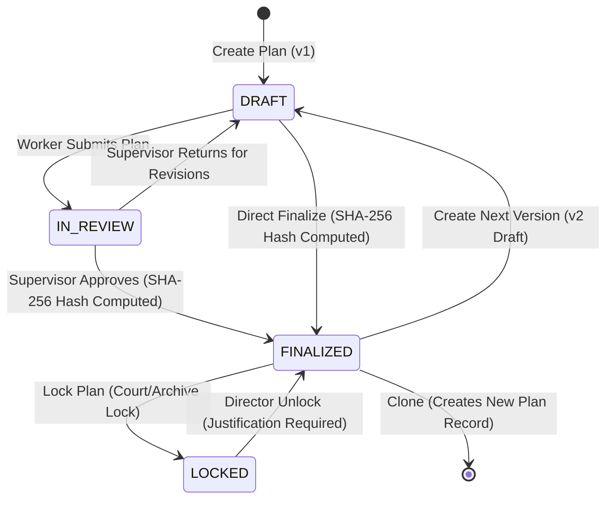

# CRBCL Family Wellness Platform — Phase 6 Architecture
## Safety Plans • Case Plans • Goals • Activities • Signatures

---

## 1. Overview & System Purpose

The **Safety & Case Planning Engine** provides standardized, child welfare-grade safety planning and family wellness case management for Cote First Nation and affiliated partner communities under Treaty 4 jurisdiction.

The system enforces child welfare governance standards:
1. **Unified Planning Relational Model**: Both immediate Crisis Safety Protocols (`SAFETY_PLAN`) and Multi-Month Family Wellness Plans (`CASE_PLAN`) share a normalized relational structure (`plan_participants`, `plan_concerns`, `plan_strengths`, `plan_goals`, `plan_activities`, `plan_signatures`).
2. **Deterministic Lifecycle Governance**: State transitions enforce draft authoring, supervisor clinical review, approval, finalization sealing, locking, and controlled director unlocking.
3. **Cryptographic Electronic Signatures & Seals**: Canonical JSON document serialization generates a deterministic SHA-256 hash upon finalization. Signatures cryptographically bind to the version document hash to guarantee tamper evidence.
4. **Goal-Linked Case Notes**: Clinical notes can link to active plan goals, enforcing cross-case referential integrity and validating that the goal belongs to a plan on the exact same case.
5. **Conflict-of-Interest Case Restrictions (ADR-010)**: All plan retrieval, authoring, signature, and goal listing endpoints strictly enforce case restriction policies.

---

## 2. Relational Entity Architecture

### Table Specifications

| Table | Purpose | Key Attributes |
| :--- | :--- | :--- |
| `plans` | Master Plan container | `id`, `case_id`, `plan_number` (PLN-YYYYMM-NNNN), `plan_type`, `title`, `status`, `current_version_id` |
| `plan_versions` | Versioned plan snapshot | `id`, `plan_id`, `version_number`, `status`, `meeting_date`, `meeting_location`, `narrative`, `document_hash` |
| `plan_participants` | Circle members & signers | `id`, `plan_version_id`, `name`, `role`, `relationship`, `participant_type`, `signature_required`, `attendance_status` |
| `plan_concerns` | Harm statements & threats | `id`, `plan_version_id`, `concern_type`, `statement`, `severity` (LOW, MEDIUM, HIGH, CRITICAL), `sort_order` |
| `plan_strengths` | Protective capacities | `id`, `plan_version_id`, `category` (CULTURAL_SPIRITUAL, FAMILY_UNITY, etc.), `statement`, `sort_order` |
| `plan_goals` | SMART goals | `id`, `plan_version_id`, `goal_text`, `category`, `target_date`, `status`, `completed_at`, `completed_by` |
| `plan_activities` | Concrete action steps | `id`, `goal_id`, `activity_text`, `responsible_name`, `responsible_type`, `due_date`, `status`, `completed_at` |
| `goal_progress_updates` | Progress timeline | `id`, `goal_id`, `status`, `notes`, `updated_by` |
| `plan_signatures` | Legal e-signatures & scans | `id`, `plan_version_id`, `signer_name`, `signer_role`, `signer_type`, `method`, `document_hash`, `signature_data`, `signature_image_url`, `attestation_text`, `signed_at` |
| `plan_assessments` | Clinical assessment links | `id`, `plan_id`, `assessment_id` |
| `plan_sequences` | Atomic sequence generator | `period` (YYYYMM), `last_value` |

---

## 3. Plan Lifecycle State Machine

---

## 4. Cryptographic Electronic Signature Engine

1. **Canonical JSON Serialization**: Deterministic serialization of the finalized version data (title, narrative, participants, concerns, strengths, goals, activities) sorted by key.
2. **SHA-256 Digest**: Computed upon transitioning to `FINALIZED`.
3. **Attestation Binding**: When an e-signature or paper scan is recorded, the engine verifies that the document content has not changed (`SignatureService.verify_integrity`) and permanently embeds the canonical `document_hash` into the signature record.
4. **Signature Methods**:
   - `CANVAS_DRAW`: Vector/PNG stroke data captured on HTML5 canvas.
   - `TYPED_ATTESTATION`: Typed legal attestation under provincial and First Nations e-signature regulations.
   - `PHYSICAL_UPLOAD`: Scanned paper document attached with physical storage audit reference.

---

## 5. Security & Authorization Matrix

| Role | Read Plans | Create Plans | Update Drafts | Submit | Approve / Return | Finalize | Lock / Unlock | Sign | Clone |
| :--- | :---: | :---: | :---: | :---: | :---: | :---: | :---: | :---: | :---: |
| **Executive Director** | YES | YES | YES | YES | YES | YES | YES | YES | YES |
| **Supervisor** | YES | YES | YES | YES | YES | YES | LOCK ONLY | YES | YES |
| **Caseworker** | YES | YES | YES | YES | NO | YES | NO | YES | YES |
| **Clinical Staff** | YES | YES | YES | YES | NO | YES | NO | YES | YES |
| **Cultural Worker** | YES | NO | NO | NO | NO | NO | NO | YES | NO |
| **Case Aide** | YES | NO | NO | NO | NO | NO | NO | YES | NO |
| **External Worker** | YES (Case assigned) | NO | NO | NO | NO | NO | NO | YES | NO |

---

## 6. Verification & Automated Test Coverage

The test suite covers 100% of Phase 6 business logic across 8 test suites:
- `tests/test_safety_plan.py`: Full lifecycle of Safety Plans.
- `tests/test_case_plan.py`: Full lifecycle of Case Plans with multi-step activities.
- `tests/test_plan_versioning.py`: Version progression (v1 -> v2) and immutability enforcement on sealed versions.
- `tests/test_plan_cloning.py`: Blueprint cloning into distinct master plan records with goal carryover toggles.
- `tests/test_plan_signatures.py`: SHA-256 canonical hashing, signature integrity verification, and physical scans.
- `tests/test_plan_case_notes.py`: Goal-linked case notes validation and cross-case goal rejection.
- `tests/test_plan_restrictions.py`: Conflict-of-interest case restriction enforcement (ADR-010).
- `tests/test_plan_workflow.py`: Director unlock governance and supervisor return workflows.
