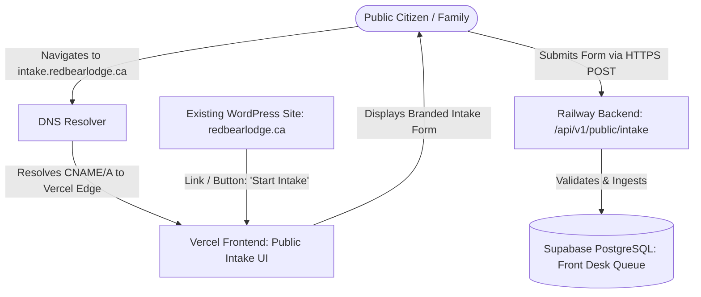

# CRBCL External Website Intake & DNS Architecture Analysis

**Document Version:** 1.0.0  
**Date:** September 18, 2026  
**Status:** Architectural Decision & Client Guidance (Authoritative)

---

## 1. Executive Summary & Client Clarification

CRBCL leadership has formally clarified that they **do not want an external API or webhook integration** (such as Google Forms / Apps Script webhook pipelines) for public intake submissions. Instead, CRBCL has requested to connect external intake using an **"A record"** (DNS Address Record).

This document outlines:
1. The technical function and boundaries of DNS Address (A) records.
2. How DNS routing interacts with modern multi-tier hosting architectures (Vercel frontend and Railway backend).
3. The recommended deployment topology (e.g. `intake.redbearlodge.ca`) for a CRBCL-hosted public intake portal.
4. Concrete technical, security, TLS, and WordPress implications before any DNS mutations are made.

> [!IMPORTANT]
> In accordance with client instruction, **the legacy Google Forms / Apps Script webhook integration is NOT to be deployed or promoted**. No live DNS records have been modified, and no arbitrary IP addresses have been configured. Controlled UAT continues using synthetic, de-identified testing.

---

## 2. Technical Capabilities and Boundaries of DNS "A" Records

### What an "A Record" Does
- An **A Record** (Address Record) is a fundamental DNS record that maps a domain name (e.g. `intake.redbearlodge.ca`) to a specific **32-bit IPv4 address** (e.g. `76.76.21.21`).
- When a citizen or family visits `intake.redbearlodge.ca` in their browser, the client resolver queries DNS, which returns the IPv4 address. The user's web browser then opens a TCP/TLS connection to that IP address to request the webpage.

### What an "A Record" CANNOT Do
- **DNS does not transport form data:** An A record merely directs network traffic to a web server. It does not ingest, validate, or serialize form submissions.
- **DNS cannot proxy form submissions from WordPress:** Having an A record for the main website (`redbearlodge.ca`) does not magically transmit forms submitted on a WordPress page to the CRBCL application server.
- **Form transport requires HTTP/HTTPS:** Form data must be transmitted via HTTP `POST` requests directly to an active web service endpoint.

---

## 3. Hosting Architecture & DNS Record Compatibility

CRBCL's Family Wellness Platform is deployed across modern cloud infrastructure:
- **Frontend SPA:** Hosted on **Vercel** (serving React / Vite assets with edge TLS termination).
- **Backend API:** Hosted on **Railway** (running FastAPI on Python 3.12 with async PostgreSQL).

### Can an A Record be used with Vercel?
- **Apex Domain (`redbearlodge.ca`):** Vercel provides a 76.76.21.21 Anycast IPv4 address for apex domains, allowing an A record. However, changing the apex domain `redbearlodge.ca` to point to Vercel would **take down the client's existing WordPress website**.
- **Subdomain (`intake.redbearlodge.ca`):** For subdomains, Vercel strongly standardizes on a **CNAME record** pointing to `cname.vercel-dns.com`. While an A record pointing to Vercel's Anycast IP is technically possible if DNS provider restrictions apply, a CNAME is standard and auto-renewing for TLS certificates and edge routing.

### Can an A Record be used with Railway?
- Railway provides dynamic ingress routers with vanity hostnames (`*.up.railway.app`). Railway custom domains require a **CNAME record** pointing to their domain proxy (`*.railway.app`). Railway **does not offer static IPv4 addresses** for individual services suitable for permanent A records.

---

## 4. Recommended Topology: Dedicated Intake Subdomain

To satisfy CRBCL's requirement without interfering with their existing WordPress marketing site (`redbearlodge.ca`), the authoritative recommended pattern is:

### Key Workflow Details:
1. **Host on Subdomain:** Configure `intake.redbearlodge.ca` (or `forms.redbearlodge.ca`).
2. **Dedicated Public Intake View:** Serve a clean, culturally safe public intake application hosted directly by CRBCL on Vercel.
3. **WordPress Integration:** The existing WordPress site remains completely untouched on its current hosting. The WordPress "Intake Form" page or navigation bar simply features a prominent button: **"Begin Sacred Intake Journey →"** linking to `https://intake.redbearlodge.ca`.
4. **Direct Secure Ingestion:** Submissions go directly from the client browser via HTTPS to the CRBCL backend, eliminating third-party form builders, Apps Script triggers, or webhook intermediaries.

---

## 5. Security & Governance Implications

1. **End-to-End Encryption (TLS):**
   - Vercel automatically provisions and renews free Let's Encrypt / DigiCert certificates for custom domains.
   - All communications remain strictly on TLS 1.3 with HSTS (`Strict-Transport-Security: max-age=31536000`).

2. **Rate Limiting & Anti-Abuse:**
   - Public-facing intake endpoints must be protected by IP rate limiting (e.g. max 5 submissions per 10 minutes per IP) and CAPTCHA / Honeypot fields to prevent denial-of-service or automated spam.

3. **No Unauthenticated Internal Exposure:**
   - Public intake endpoints only insert into an isolated `front_desk_submissions` triage staging table.
   - They **never** create direct `active` Clients, Caseworker notes, or Person IDs without Front Desk human triage.

---

## 6. Information Still Required from CRBCL Domain Administrator

Before executing any DNS changes in production, the following information must be provided by CRBCL or their DNS registrar (e.g. GoDaddy, Namecheap, Cloudflare):

| Parameter | Current Status | Action Required |
| :--- | :--- | :--- |
| **Target Subdomain** | Suggested: `intake.redbearlodge.ca` | Confirm exact preferred hostname with CRBCL leadership. |
| **DNS Provider / Registrar** | Unknown | Identify where `redbearlodge.ca` DNS zone is managed. |
| **DNS Record Type** | Client requested A record | Confirm whether DNS provider supports CNAME or ALIAS for subdomains. |
| **Existing WordPress Status** | Active on `redbearlodge.ca` | Confirm WordPress hosting must not be disturbed. |
| **Public Form Requirements** | In draft | Align on exact public intake questions and cultural fields needed on the CRBCL-hosted form. |

---

## 7. Conclusion

Connecting intake via DNS means **pointing a dedicated hostname (`intake.redbearlodge.ca`) to the CRBCL-hosted application**. An A or CNAME record routes the user's browser to the intake application, where submissions enter CRBCL directly over secure HTTPS.

No DNS records will be changed until CRBCL domain management provides registrar credentials and confirms the target hostname.
