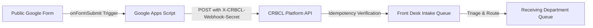

# CRBCL Google Form Public Intake Webhook Integration Guide

This guide describes how to configure the Google Apps Script webhook trigger that automatically ingests responses submitted to the public Google Form into the Chief Red Bear Children's Lodge (CRBCL) platform.

---

## 1. Architecture Overview

- **Authentication**: Secured via `X-CRBCL-Webhook-Secret` header using constant-time string comparison.
- **Idempotency**: Submissions include Google's unique `response_id`. Duplicate deliveries return the existing `FD-YYYY-NNNNNN` reference without creating duplicate records.
- **Zero Entity Creation on Ingestion**: The webhook does **not** create Person, Client, Family, or Case records.
- **Payload Immutability**: All form answers are preserved verbatim in `payload_raw`.

---

## 2. Setup Instructions

### Step 1: Open Apps Script in your Google Form
1. Open the target public Google Form in Google Forms.
2. In the top-right corner, click **More** (three vertical dots `⋮`) and select **Script editor**.
3. Replace the default code with the contents of [google_apps_script_webhook.js](./google_apps_script_webhook.js).

### Step 2: Configure Script Properties (Secret & URL)
1. In the Apps Script editor, click **Project Settings** (gear icon ⚙️ on the left navigation).
2. Scroll to the **Script Properties** section.
3. Click **Add script property** and add:
   - **Property**: `CRBCL_WEBHOOK_URL`
   - **Value**: `https://api.crbcl.ca/api/v1/front-desk/ingest/google-form` (or your environment's URL)
4. Click **Add script property** again and add:
   - **Property**: `CRBCL_WEBHOOK_SECRET`
   - **Value**: *(The secret configured in CRBCL's `FRONT_DESK_WEBHOOK_SECRET` environment setting)*
5. Click **Save script properties**.

### Step 3: Install the `onFormSubmit` Trigger
1. In the Apps Script editor, click **Triggers** (alarm clock icon ⏰ on the left navigation).
2. Click **+ Add Trigger** (bottom right).
3. Configure the trigger as follows:
   - **Choose which function to run**: `onFormSubmit`
   - **Choose which deployment should run**: `Head`
   - **Select event source**: `From form`
   - **Select event type**: `On form submit`
   - **Failure notification settings**: `Notify me immediately`
4. Click **Save**. Grant the required permissions when prompted by Google.

---

## 3. Reliability & Error Handling
- **Retries**: The script includes an exponential backoff loop (attempts up to 3 times on network failure).
- **Safe Logging**: Only HTTP status codes and response IDs are logged; secrets are strictly kept in `ScriptProperties` and never logged.
